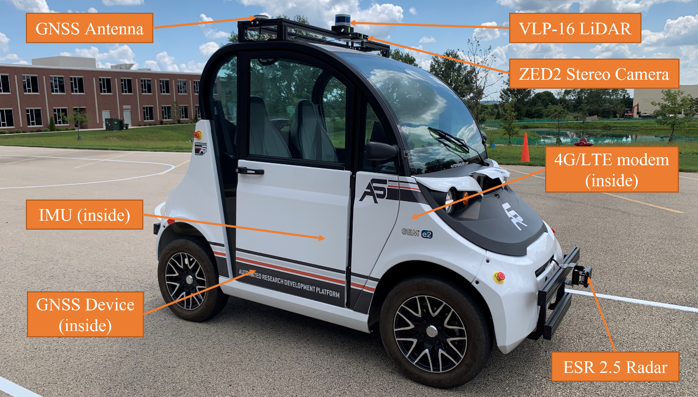

## Simulator of Polaris GEM e2 for [ECE484](https://publish.illinois.edu/safe-autonomy/) and [CS588](http://luthuli.cs.uiuc.edu/~daf//courses/MAAV-22/588-2022-home.html)

### University of Illinois at Urbana-Champaign

### Author: Hang Cui (hangcui3@illinois.edu)

### System: Ubuntu 20.04 + ROS Noetic

This simulator was initially developed with ROS Melodic and Gazebo 9 in Ubuntu 18.04 for personal research in fall 2019. The Polaris GEM e2 vehicle was measured and modeled by Hang Cui and Jiaming Zhang using Solidworks. The compatible URDF files of simulator for RViz and Gazebo were constructed by Hang Cui. Later, this project was funded by the [Center of Autonomy](https://autonomy.illinois.edu/) at University of Illinois at Urbana-Champaign. It was further developed and merged into ROS Noetic and Gazeno 11 in the summer of 2021. This simulator is currently under development for research and teaching at University of Illinois at Urbana-Champaign.  

### Polaris GEM e2 Vehicle

  
